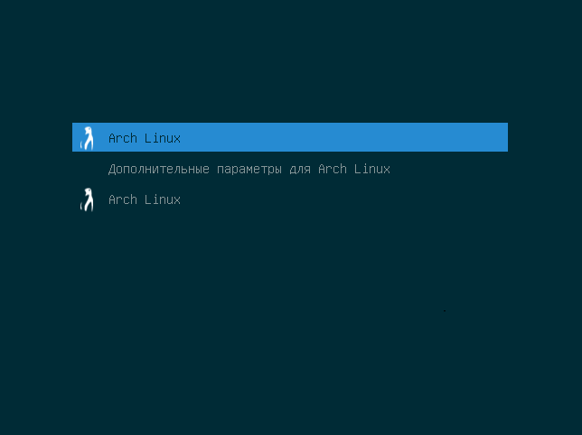

# grub-solarized-dark-blue

How to install:

~~~
git clone https://github.com/Izet-Kali/grub-solarized-dark-blue
cd grub-solarized-dark-blue
sudo chmod +777 install.sh
sudo ./install.sh
cd ..
sudo rm -dR grub-solarized-dark-blue/
reboot
~~~
